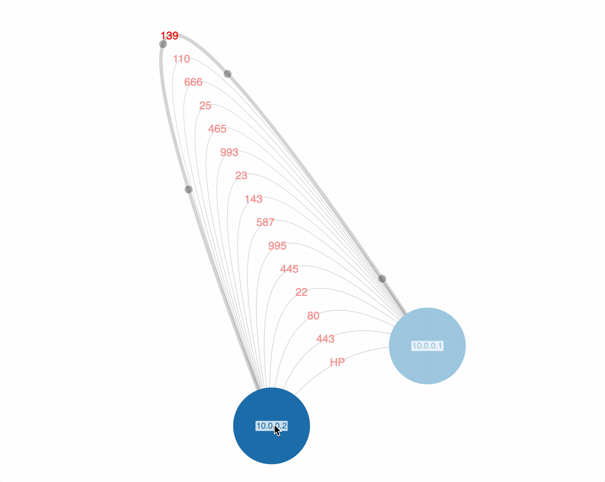
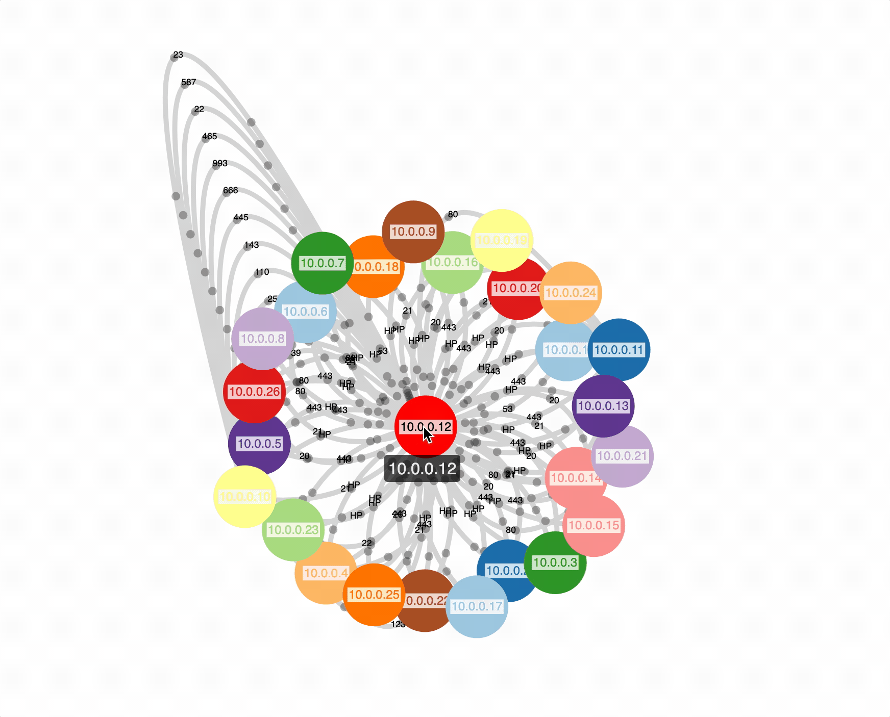
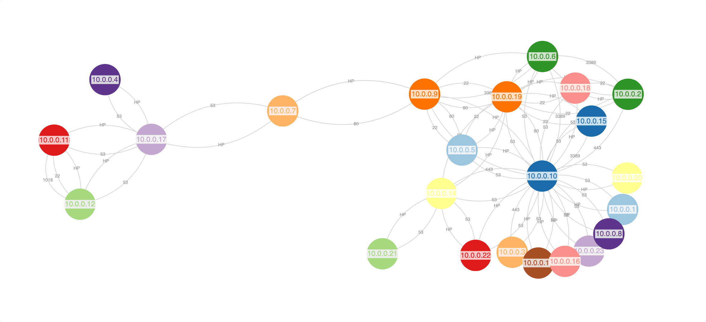

Visualize traffic patterns within your AWS environment. Solution assumes you already have VPC flow logs going to a centralized S3 bucket. We'll also need an Athena table to query with the awswrangler library. Like all things, your mileage may vary. A good base repo for your own visualization needs. 


## 🦄 Features 

- visualize links between ip addresses in AWS
- visualize traffic for a specific ip
- visualize rejected traffic for a specific ip
- view ports associated with links
- hover on nodes to highlight their links


## 🏗️ Setup

Create an Athena table like the one below.
> - the logic relies on the column names as defined below 
> - this assumes a centralized flow log bucket for your organization

```sql
CREATE EXTERNAL TABLE IF NOT EXISTS `default`.`vpclogs` (
version int,
account string,
interfaceid string,
srcaddr string,
dstaddr string,
srcport int,
dstport int,
protocol int,
packets int,
bytes int,
start_time int,
end_time int,
action string,
status string
)
PARTITIONED BY (account_id string, region string, day string)
ROW FORMAT DELIMITED
FIELDS TERMINATED BY ' '
LOCATION 's3://<BUCKET>/AWSLogs/'
TBLPROPERTIES (
'has_encrypted_data' = 'true',
"skip.header.line.count"="1",
"projection.enabled" = "true",
"projection.account_id.type" = "injected",
"projection.region.type" = "enum",
"projection.region.values" = "us-east-1,us-west-2,ap-south-1,eu-west-1",
"projection.day.type" = "date",
"projection.day.range" = "2021/01/01,NOW",
"projection.day.format" = "yyyy/MM/dd",
"storage.location.template" = "s3://<BUCKET>/AWSLogs/${account_id}/vpcflowlogs/${region}/${day}/"
)
```


Clone the repo.

```bash
git clone https://github.com/rowlinsonmike/flow-optics
```

Create a virtual env and activate it.

```bash
python3 -m venv env
source env/bin/activate
```

Install required packages.

```bash
pip3 install -r requirements.txt
```
    
## 💫 Usage

Run python CLI.

> - make sure you have AWS credentials in your environment for the account with the Athena table
> - ports greater than 1023 are labeled as HP
> - results served on http://localhost:8000


**Inspect rejects pertaining to a specific ip address.**


<p align="center">
    
</p>

```bash
Usage: python3 main.py rejects <account_id> <days> <ip_address> [<cidr_range>]
account_id        12 digit aws account id
days              integer that specifies number of days ago for query start range
ip_address        valid ip address
cidr_range        valid cidr range to narrow the results
```

example
```bash
python3 main.py rejects 123456789123 1 10.0.0.1 10.0.0.0/8
```

**Inspect flow pertaining to a specific ip address**

<p align="center">
    
</p>

```bash
Usage: python3 main.py inspect <account_id> <days> <ip_address> [<cidr_range>]
account_id        12 digit aws account id
days              integer that specifies number of days ago for query start range
ip_address        valid ip address
cidr_range        valid cidr range to narrow the results
```

example
```bash
python3 main.py inspect 123456789123 1 10.0.0.1 10.0.0.0/8
```

**Inspect internetworking of a group of ip addresses**

<p align="center">
    
</p>

```bash
Usage: python3 main.py correlate <account_id> <days> <ip_addresses>
account_id        12 digit aws account id
days              integer that specifies number of days ago for query start range
ip_addresses      comma seperated string of ip addresses
```

example
```bash
python3 main.py correlate 123456789123 1 10.0.0.1,10.0.0.2,10.0.0.3
```

**Serve last query in the browser**

```bash
Usage: python3 main.py serve
```

example
```bash
python3 main.py serve
```


## 🙌 Acknowledgements

 - [Vasco's react-force lib](https://github.com/vasturiano/force-graph)

 > Amazing lib! For this use case I needed to use curved links WITH text. It was fun figuring out how to wire up bezier-js to help with this. 


